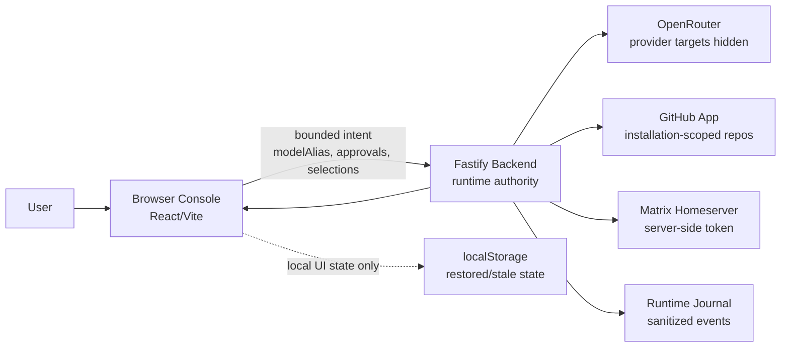
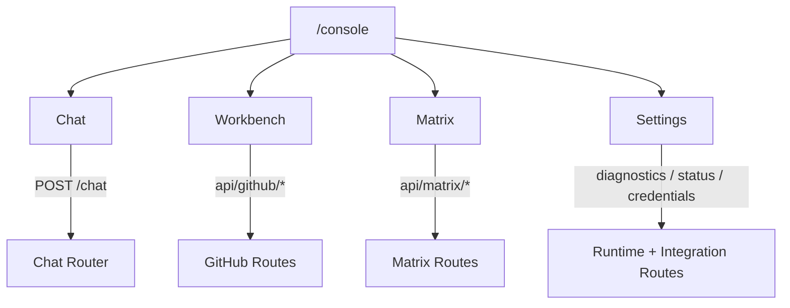
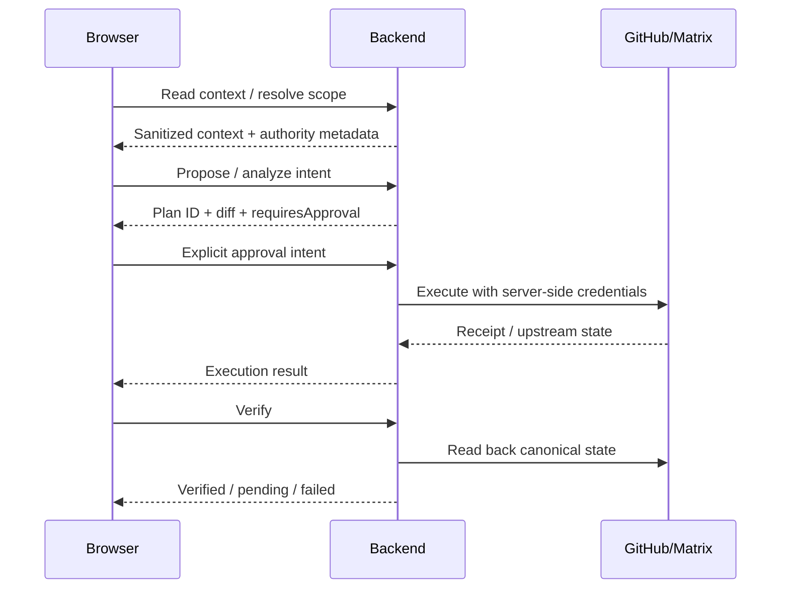
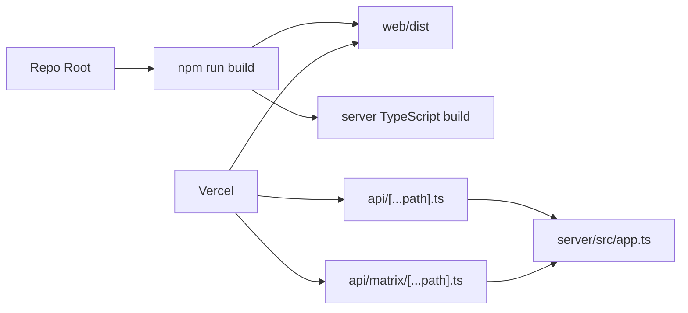

# MosaicStacked

MosaicStacked ist eine backend-first Console für Chat, Repository-Arbeit und Matrix-gestützte Wissensräume. Die Browseroberfläche zeigt Absicht, Status und Review-Flächen; die Runtime-Wahrheit liegt beim Backend.

Der aktuelle Stand ist kein reines Demo-Frontend: Chat, GitHub-Workbench, Matrix-Workspace und Settings sind als vier Console-Flächen verdrahtet. Provider-IDs, GitHub-/Matrix-Credentials und Ausführungswahrheit bleiben serverseitig.

## Ist-Zustand

| Fläche | Stand | Authority |
| --- | --- | --- |
| Chat | Backend-gerouteter OpenRouter-Chat mit non-stream und SSE, `default-free` Alias und optionalen lokalen Profil-Credentials | Backend |
| Workbench | GitHub-App-basierte Repo-Auswahl, Context Reads, Vorschlagspläne, approval-gated Execute, Verify und Datei-/Tree-Reads | Backend |
| Matrix | WhoAmI, Joined Rooms, Scope Resolve/Summary, Provenienz, Topic Analyze, Plan Refresh, approval-gated Topic Execute und Verify | Backend |
| Settings | Integrationsstatus, OpenRouter-Credential-Status, Diagnostics, Journal, Work Mode und Verbindungstests | Backend + Browser-Intent |
| Browser Shell | Vier Tabs, mobile-first Layout, Truth Rail, Keyboard-Navigation, lokale Session-Wiederherstellung als UI-State | Browser |

Wichtig: Matrix Topic Write ist lokal über Routen und Tests vorhanden. Live-E2E gegen einen echten Matrix-Origin, Evidence-Room-Writes und erweiterte Hierarchieflächen bleiben opt-in bzw. begrenzt.

## Architektur



## Authority-Regeln

- Backend besitzt Provider Calls, SSE-Framing, Modellrouting, GitHub-/Matrix-Credentials, Planung, Ausführung und Verifikation.
- Browser besitzt Rendering, lokale UI-State-Wiederherstellung, Navigation und Approval-Intent.
- Provider-IDs sind keine UI-Wahrheit.
- Matrix-Credentials dürfen nicht im Browser liegen.
- Wiederhergestellter Browserzustand ist nicht backend-frische Wahrheit.
- Malformed SSE, GitHub- oder Matrix-Antworten werden fail-closed behandelt.
- Browser Writes dürfen Backend-Approval-Gates nicht umgehen.

## Console-Flächen



### Chat

- `POST /chat` akzeptiert bounded intent (`task`, `mode`, `preference`, `modelAlias`) und keine rohen Provider-Ziele.
- Streaming nutzt die Lifecycle-Reihenfolge `start -> route -> token* -> done|error`.
- `GET /models` liefert öffentliche Aliase, Labels, Capabilities und Verfügbarkeit, aber keine Provider-IDs.
- `default-free` wird serverseitig aus Profil-Credentials, Env-Konfiguration oder lokalem Dev-Fallback aufgelöst.
- `user_openrouter_default` nutzt backendseitig gespeicherte lokale Profil-Credentials.

### Workbench / GitHub

- GitHub-Verbindungen laufen über backend-owned Auth-Start/Callback und GitHub-App-Installation.
- Repository-Scope kommt primär aus der GitHub-App-Installationsauswahl; `GITHUB_ALLOWED_REPOS` kann Instance-Mode einschränken.
- Workbench liest Repo-Kontext, erzeugt Vorschlagspläne, zeigt Diffs und führt nur mit expliziter Freigabe aus.
- Execute bleibt zusätzlich durch `GITHUB_AGENT_API_KEY` bzw. `X-MosaicStacked-Admin-Key` geschützt.

### Matrix

- Read-Flächen: `whoami`, `joined-rooms`, Scope Resolve, Scope Summary, Room Provenance und Topic Access.
- Action-Flächen: Analyze, Plan Fetch/Refresh, approval-gated Execute und Verify für unterstützte Topic-Änderungen.
- Scope- und Planzustand ist backend-owned und TTL-/staleness-gebunden.
- Browser Composer- und Queue-Aktionen bleiben fail-closed, wenn kein passender backendseitiger Write-Contract aktiv ist.

### Settings

- Zeigt Backend Health, Modellstatus, GitHub-/Matrix-Verbindung, Rate Limits, Action Store, Journal und Routingstatus.
- Speichert OpenRouter-Credentials backendseitig pro lokalem Profil.
- Integration Connect/Reconnect/Disconnect/Reverify wird als backend-owned Intent gestartet.

## Approval-Flow



## Repository Map

| Pfad | Rolle |
| --- | --- |
| `web/` | Vite + React Console, UI-State, mobile Shell, Chat/Workbench/Matrix/Settings |
| `server/` | Fastify Authority Layer für Chat, GitHub, Matrix, Auth, Diagnostics und Journal |
| `api/[...path].ts` | Vercel Serverless Adapter für allgemeine Backend-Routen |
| `api/matrix/[...path].ts` | Separater Vercel Adapter für Matrix-Routen |
| `config/model-capabilities.yml` | Runtime-geladener Modellfähigkeits-Contract |
| `config/llm-router.yml` | Legacy-/Kompatibilitäts-Routing-Konfiguration |
| `docs/` | Vertiefende Contracts, Routing-, Deployment-, Test- und UX-Dokumente |
| `02-wiki/` | Governance Index und Append-only Log |
| `03-mspr/packets/` | Review-Packets für Risiken, Blocker und Authority-Lücken |

## Backend-Routen

| Bereich | Routen |
| --- | --- |
| Health/Models | `GET /health`, `GET /models`, `POST /models/openrouter` |
| Chat | `POST /chat` |
| Settings/OpenRouter | `GET /settings/openrouter/status`, `POST /settings/openrouter/credentials`, `POST /settings/openrouter/test` |
| Diagnostics/Journal | `GET /diagnostics`, `GET /journal/recent` |
| Local Auth | `POST /api/auth/login`, `GET /api/auth/me`, `POST /api/auth/logout` |
| Integrations | `GET /api/integrations/status`, `GET/POST /api/auth/{github,matrix}/*` |
| GitHub | `GET /api/github/capabilities`, `GET /api/github/repos`, `POST /api/github/context`, `POST /api/github/actions/propose`, `GET/POST /api/github/actions/:planId/*`, repo tree/file reads |
| Matrix | `GET /api/matrix/whoami`, `GET /api/matrix/joined-rooms`, `POST /api/matrix/scope/resolve`, `POST /api/matrix/analyze`, scope summary, provenance, topic access, action fetch/execute/verify |

## Lokal starten

```bash
npm install
cp .env.example .env
npm run dev:server
npm run dev:web
```

Standard-Ports:

- Backend: `127.0.0.1:8787`
- Vite Web: `127.0.0.1:5173`

Die Browser-App liest nur browserseitige Overrides. Secrets gehören in die repo-root `.env` und bleiben backendseitig.

## Wichtige Env-Flächen

| Zweck | Variablen |
| --- | --- |
| OpenRouter Profil-Credentials | `USER_CREDENTIALS_ENCRYPTION_KEY`, `USER_CREDENTIALS_PROFILE_SECRET`, `USER_CREDENTIALS_STORE_MODE` |
| Default-Free Routing | `OPENROUTER_API_KEY`, `OPENROUTER_DEFAULT_MODEL`, `OPENROUTER_DEFAULT_LABEL` |
| Routing Policy | `MODEL_ROUTING_MODE`, `ALLOW_MODEL_FALLBACK`, `MODEL_ROUTING_FAIL_CLOSED` |
| GitHub App | `GITHUB_APP_ID`, `GITHUB_APP_PRIVATE_KEY`, `GITHUB_APP_SLUG`, `GITHUB_APP_INSTALLATION_ID` |
| GitHub OAuth Install/Auth | `GITHUB_OAUTH_CLIENT_ID`, `GITHUB_OAUTH_CLIENT_SECRET`, `GITHUB_OAUTH_CALLBACK_URL` |
| Approval-Gated GitHub Execute | `GITHUB_AGENT_API_KEY` |
| Integration Auth Store | `MOSAIC_STACK_SESSION_SECRET`, `INTEGRATION_AUTH_ENCRYPTION_CURRENT_KEY`, `INTEGRATION_AUTH_STORE_MODE` |
| Matrix | `MATRIX_ENABLED`, `MATRIX_BASE_URL`, `MATRIX_SSO_CALLBACK_URL`, `MATRIX_ACCESS_TOKEN`, `MATRIX_EXPECTED_USER_ID` |
| Matrix Evidence Writes | `MATRIX_EVIDENCE_WRITES_ENABLED`, `MATRIX_EVIDENCE_*_ROOM_ID` |

## Deployment



Vercel-Shape:

- Project root: Repo root
- Build command: `npm run build`
- Output directory: `web/dist`
- API entrypoints: `api/[...path].ts` und `api/matrix/[...path].ts`
- Secrets: ausschließlich serverseitige Vercel Environment Variables

## Verifikation

Empfohlener lokaler Gate:

```bash
npm run typecheck
npm test
npm run build
```

Fokussierte Checks:

```bash
npm run typecheck:server
npm run test:server
npm run typecheck:web
npm run test:web
npm run test:browser
```

Opt-in Live-Smokes:

```bash
npm run test:matrix-live
npm run test:matrix-evidence-live
npm run test:integration-auth-rotation-live
npm run test:integration-auth-rotation-live:matrix
npm run test:integration-auth-rotation-live:both
```

## Aktuelle Grenzen

- Live Matrix E2E gegen einen echten Origin ist opt-in und nicht Teil des Standard-Gates.
- Evidence-Room-Writes sind konfigurierbar, aber standardmäßig deaktiviert.
- Matrix-Hierarchie ist als Browser-/Contract-Fläche getrennt zu behandeln, solange kein vollständiger Server-Contract verifiziert ist.
- Undo, Cross-device Sync, Bulk Review Queue, langlebige serverless Action Stores und erweiterte Observability bleiben nachgelagert.
- Lokale `memory`-/`file`-Stores sind Entwicklungs- und Preview-Hilfen, keine dauerhafte Produktionspersistenz.
